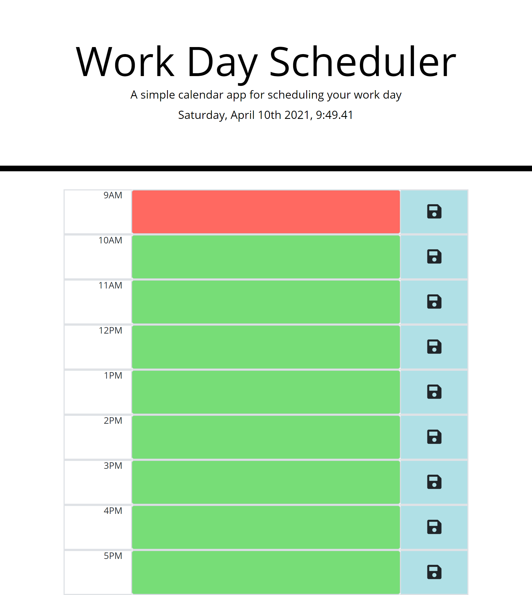

# 05-Third-Party-APIs-Work-Day-Scheduler

## Link to deployed application

https://deucedadorian.github.io/05-Third-Party-APIs-Work-Day-Scheduler/

## Description

This application uses jquery, bootstrap, and moment.js to allow you to plan out your work day. you can write out your schedule for each hour and the app will help you to keep track of time by coloring each hour with colors for past, present, and future.

## Usage

Simply click on the textarea of the timeblock you want to alter and type in your schedule for the hour. when you are done, click the save icon and everything you typed for the timeblock will be saved in local storage for later use.

## Screenshots

## License

MIT License

Copyright (c) [2021] [Dylan Cole]
